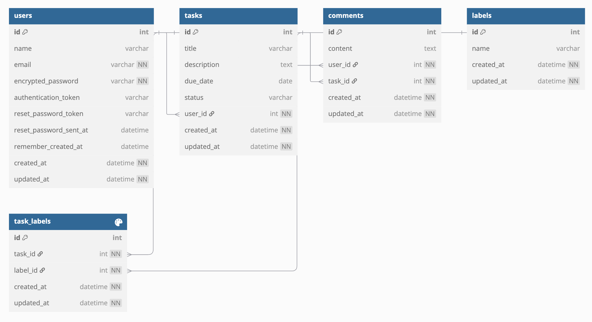

# Task Manager API - Completion Report

## ✅ Functional Requirements Completion

### **1. JSON-based API for relevant endpoints**  
✔ Implemented a fully functional JSON-based API with **8 endpoints**:
   - **User Signup** (`POST /api/users`)
   - **User Login** (`POST /api/users/sign_in`)
   - **User Logout** (`DELETE /api/users/sign_out`)
   - **Update User Name** (`POST /api/users/update_name`)
   - **Get All Tasks** (`GET /api/tasks`)
   - **Get Task Details** (`GET /api/tasks/:id`)
   - **Create Task** (`POST /api/tasks`) (As bonus)
   - **Delete Task** (`DELETE /api/tasks/:id` )(As bonus)

### **2. API-based user authentication & authorization**  
✔ Authentication and authorization are implemented using **token-based authentication**. Users must include an authentication token in the request header to access protected endpoints.

### **3. Devise for user authentication/authorization**  
✔ The application uses **Devise gem** to handle user authentication and token management.

### **4. Mobile/Postman Testing**  
✔ All API functionalities were tested using **Postman** and **cURL commands**. The following were verified:
   - ✅ **User Signup/Login**: Successfully tested user registration and authentication.
   - ✅ **Collection Page (GET request returning multiple items)**: `GET /api/tasks` returns a list of tasks.
   - ✅ **Details Page (GET request retrieving a single item)**: `GET /api/tasks/:id` returns details of a specific task.
---
## 📌 Application Flow

1. **User Registration & Authentication**
   - A new user signs up via `POST /api/users`.
   - The user logs in via `POST /api/users/sign_in`, receiving an authentication token.
   - Authenticated users can update their name via `PATCH /api/users/update_name`.
   - Users can log out via `DELETE /api/users/sign_out`.

2. **Task Management**
   - Authenticated users can **create** new tasks via `POST /api/tasks`.
   - Users can **view all tasks** (`GET /api/tasks`) and **view specific tasks** (`GET /api/tasks/:id`).
   - Tasks can be **updated** and **deleted** (`DELETE /api/tasks/:id` by their owner).

3. **Authorization Handling**
   - Users must include their authentication token in the request headers.
   - Unauthorized access attempts return a `401 Unauthorized` response.
   - Actions like task deletion are restricted to the task owner.

---

## **📊 Database Schema (ER Diagram)**
