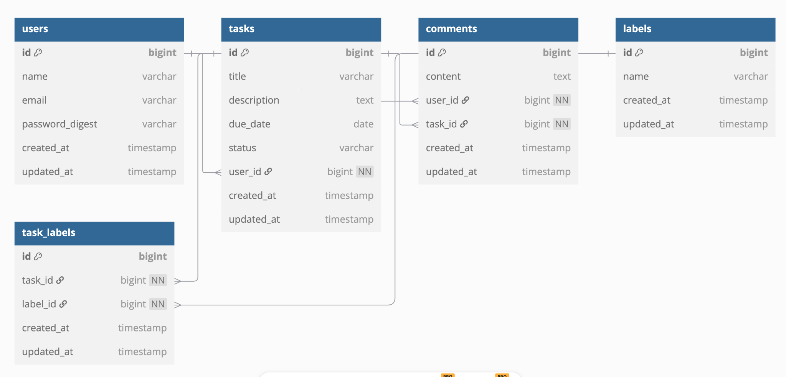

## **🚀 Task Manager - Rails Web Application**

### **📌 Overview**
This project is a **Task Management System** built with **Ruby on Rails**, following the **MVC pattern**. It allows users to:
- **Sign up, log in, and log out**.
- **Create, edit, delete, and view tasks**.
- **Assign labels to tasks**.
- **Comment on tasks**.
- **Filter tasks by status and labels**.

The application is deployed on **Heroku** and uses **PostgreSQL** as its database.

---

## **📂 Features**
### **✅ Functional Requirements**
✔️ **User Authentication & Authorization**  
✔️ **Session Management**  
✔️ **4 Models**: `User`, `Task`, `Comment`, `Label`  
✔️ **1 Nested Resource**: `Comments` are nested under `Tasks`  
✔️ **Model Relationships**:
- **One-to-Many** (`User → Tasks`, `Task → Comments`)
- **Many-to-Many** (`Task ↔ Label` via `TaskLabel`)
- **Rich One-to-Many** (`TaskLabel` with extra attributes)

---

## **📝 Test Accounts**
| **Role** | **Email** | **Password** |
|----------|----------|--------------|
| **Alice** | `alice@example.com` | `password` |
| **Bob** | `bob@example.com` | `password` |
| **Cassy** | `cassy@example.com` | `password` |

---

## **📊 Database Schema (ER Diagram)**


---

## **💡 Application Flow**
1. **User Authentication**:
   - Users **sign up or log in**.
   - Each session is **maintained with session cookies**.
2. **Task Management**:
   - Users can **create, edit, and delete their own tasks**.
   - Users can **view tasks created by others**.
   - Tasks have **status, due dates, and labels**.
3. **Labels & Filtering**:
   - Users can **assign predefined labels**.
   - Tasks can be **filtered by status & labels**.
4. **Comments**:
   - Users can **comment on tasks**.
   - Users can **only delete their own comments**.

---

## **🛠️ Installation Guide**
### **🔹 Prerequisites**
Ensure you have the following installed:
- **Ruby (3.x)**
- **Rails (7.x)**
- **PostgreSQL**
- **Heroku CLI**

---

### **🔹 1. Clone the Repository**
```sh
git clone https://github.com/yourusername/task_manager.git
cd task_manager
```

### **🔹 2. Install Dependencies**
```sh
bundle install
```

### **🔹 3. Set Up the Database**
```sh
rails db:create
rails db:migrate
rails db:seed
```

### **🔹 4. Start the Server**
```sh
rails server
```
Visit **http://localhost:3000** in your browser.